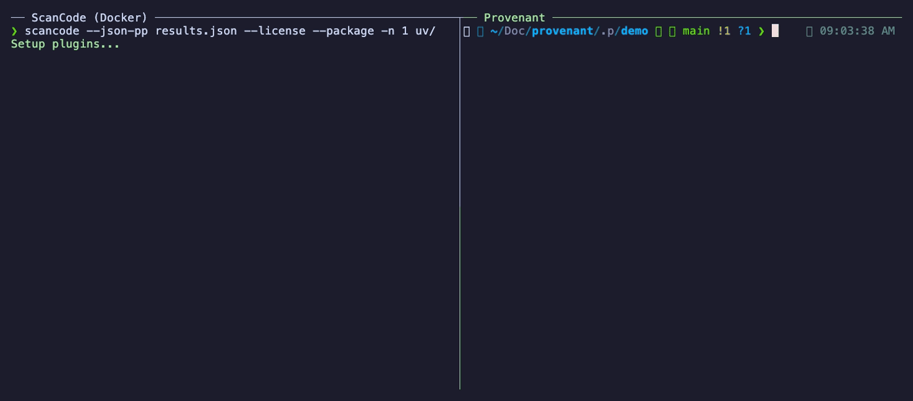

# Provenant

[Why Provenant?](#why-provenant) · [Choose a Workflow](#choose-a-workflow) · [Install](#install) · [CLI Guide](docs/CLI_GUIDE.md) · [Benchmarks](docs/BENCHMARKS.md) · [Supported Formats](docs/SUPPORTED_FORMATS.md) · [Architecture](docs/ARCHITECTURE.md)

[](https://github.com/getprovenant/provenant/releases/latest)
[](https://crates.io/crates/provenant-cli)
[](https://github.com/getprovenant/provenant/actions/workflows/check.yml)
[](LICENSE)

Provenant is a fast, Rust-based code scanner for licenses, copyrights, package metadata, file metadata, and related provenance data, focused on correctness, safe static parsing, and native execution.

Across documented benchmark targets, Provenant is frequently about an order of magnitude faster than [ScanCode Toolkit](https://github.com/aboutcode-org/scancode-toolkit), whose scanning engine it ports to Rust and builds on. On top of that it adds broader package and dependency extraction, cleaner results, and CI-ready compliance gating — see [Why Provenant?](#why-provenant).



_The same [`astral-sh/uv`](https://github.com/astral-sh/uv) scan, identical flags (`--license --package`), one process each: Provenant finishes in seconds while ScanCode is still going. Full comparisons: [benchmarks](docs/BENCHMARKS.md)._

> [!IMPORTANT]
> **Project status:** production-usable and compatibility-focused.
> Provenant targets parity for documented ScanCode-compatible workflows and output formats.

## Quick Start

```sh
brew install getprovenant/tap/provenant
provenant scan --json-pp - --license --package /path/to/repo
```

Not on Homebrew (or on Windows)? `cargo install provenant-cli`, grab a [prebuilt archive](https://github.com/getprovenant/provenant/releases), or run the [container image](#container-image).

## Why Provenant?

- [Benchmark-backed](docs/BENCHMARKS.md) speedups — frequently about an order of magnitude faster than ScanCode on recorded same-host runs
- Package and dependency extraction across [many ecosystems](docs/SUPPORTED_FORMATS.md), reading manifests and lockfiles into structured package metadata and dependency graphs
- Monorepo-aware inventories — workspace, reactor, and multiproject layouts (Cargo, npm/pnpm/yarn, Maven, Gradle, uv, Mix, Dart, and related) attribute nested sources and shared locks to the package that owns them
- Low-noise license and copyright detection — suppresses common false-positive classes such as code and prose bleed, and treats bare-word GPL/LGPL mentions as license clues; see [documented improvements](docs/improvements/README.md)
- CI license-compliance gating — policy severities with a build-failing [`--fail-on`](docs/CLI_GUIDE.md#17-i-want-policy-aware-license-review) gate and SARIF output for the code-scanning UI
- Native workflows: `--incremental` cache reuse, `--paths-file` changed-file scans with SBOM completeness warnings when a selection may understate a workspace, and long-lived HTTP service mode via [`provenant serve`](docs/SERVE_API_GUIDE.md)
- Source-faithful file-level copyright by default — e.g. `Copyright © 2024 Example Corp. All rights reserved.` is kept verbatim, not ASCII-folded and trimmed to `Copyright (c) 2024 Example Corp.`
- Single self-contained binary with parallel native execution
- [Security-first](docs/adr/0004-security-first-parsing.md) static parsing — no execution of scanned code or package-manager code, with bounded resource use

## Choose a Workflow

| If you need to...                                      | Start here                                                                       | Next doc                                                                                   |
| ------------------------------------------------------ | -------------------------------------------------------------------------------- | ------------------------------------------------------------------------------------------ |
| Run a one-off CLI scan                                 | `provenant scan --json-pp - --license --package /path/to/repo`                   | [CLI Guide](docs/CLI_GUIDE.md)                                                             |
| Scan explicit changed files in CI or automation        | Use `--paths-file` with one native scan root                                     | [CLI Guide](docs/CLI_GUIDE.md)                                                             |
| Run a scan in a container                              | `docker run -v "$PWD:/src" ghcr.io/getprovenant/provenant scan /src --json-pp -` | [Container Image](#container-image)                                                        |
| Run a scan from a GitHub Actions workflow              | `uses: getprovenant/provenant-action@v1`                                         | [provenant-action](https://github.com/getprovenant/provenant-action)                       |
| Gate CI on disallowed licenses (fail the build, SARIF) | `--license-policy policy.yml --fail-on error`                                    | [CLI Guide](docs/CLI_GUIDE.md#17-i-want-policy-aware-license-review)                       |
| Reuse a warm process through HTTP                      | `provenant serve --help`                                                         | [Serve API Guide](docs/SERVE_API_GUIDE.md)                                                 |
| Embed Provenant in a Rust application                  | Use the `provenant` library target from `provenant-cli`                          | [Library Guide](docs/LIBRARY_GUIDE.md)                                                     |
| Evaluate Provenant with an existing ScanCode workflow  | Start from Provenant's compatibility and workflow-difference notes               | [Evaluating Provenant with ScanCode workflows](docs/EVALUATING_WITH_SCANCODE_WORKFLOWS.md) |

## Relationship to ScanCode

Provenant is an independent project and is not affiliated with, endorsed by, or sponsored by ScanCode Toolkit, AboutCode, or nexB Inc.

| Topic              | Provenant                                                                                                                                                              |
| ------------------ | ---------------------------------------------------------------------------------------------------------------------------------------------------------------------- |
| Implementation     | Independent Rust scanner; originally a port of the ScanCode engine, developed substantially beyond it                                                                  |
| Compatibility goal | Strong compatibility with ScanCode workflows and output semantics where practical                                                                                      |
| Upstream data      | Uses the upstream ScanCode license and rule data as a foundational dataset                                                                                             |
| Evaluation path    | For teams evaluating Provenant against existing compatible workflows, see the [evaluation guide](docs/EVALUATING_WITH_SCANCODE_WORKFLOWS.md) for notes and differences |

## Install

### Homebrew (macOS and Linux)

```sh
brew install getprovenant/tap/provenant
```

Installs a prebuilt `provenant` binary from the [Provenant tap](https://github.com/getprovenant/homebrew-tap); covers macOS (Apple Silicon and Intel) and Linux (arm64 and x86_64).

### From Crates.io

Install the crates.io package `provenant-cli`:

```sh
cargo install provenant-cli
```

This installs the `provenant` command-line binary.

### Download Precompiled Binary

Download the release archive for your platform from the [GitHub Releases](https://github.com/getprovenant/provenant/releases) page.

Extract the archive and place the binary somewhere on your `PATH`.

On Linux and macOS:

```sh
tar xzf provenant-*.tar.gz
sudo mv provenant /usr/local/bin/
```

On Windows, extract the `.zip` release and add `provenant.exe` to your `PATH`.

### Container Image

Prebuilt, statically linked multi-arch images (`linux/amd64`, `linux/arm64`) are published to the GitHub Container Registry as [`ghcr.io/getprovenant/provenant`](https://github.com/getprovenant/provenant/pkgs/container/provenant), tagged with the full version (e.g. `0.2.5`), the `major.minor` series (e.g. `0.2`), and `latest`:

```sh
docker run --rm -v "$PWD:/src" ghcr.io/getprovenant/provenant:latest \
  scan /src --json-pp - --license --package
```

The image entrypoint is the `provenant` binary, so any CLI arguments can follow the image reference. To scan a project, mount it into the container and pass the mounted path as the scan target.

### Build from Source

For a normal source build, you only need the Rust toolchain:

```sh
git clone https://github.com/getprovenant/provenant.git
cd provenant
cargo build --release
```

Cargo places the compiled binary under `target/release/`.

> **Note**: The binary includes a built-in compact license index. The `reference/scancode-toolkit/` submodule is only needed for developers updating the embedded license data, using maintainer commands that depend on it, or maintaining Provenant's built-in license dataset.

## Usage

### CLI Scanning

```sh
provenant scan --json-pp <FILE> [OPTIONS] <INPUT>...
```

> [!NOTE]
> Provenant requires at least one explicit output flag, such as `--json-pp -` or `--json scan-results.json`.

For the command tree, run:

```sh
provenant --help
```

For the complete scan-flag surface, run:

```sh
provenant scan --help
```

### Example

```sh
provenant scan --json-pp scan-results.json --license --package ~/projects/my-codebase --ignore "*.git*" --ignore "target/*" --ignore "node_modules/*"
```

Use `-` as `FILE` to write an output stream to stdout, for example `--json-pp -`.
Multiple output flags can be used in a single run.
When using `--from-json`, you can pass multiple JSON inputs. Native directory scans also support multiple input paths using common-prefix behavior.
For guided workflows, flag combinations, cache controls, and stdin-driven file lists, see the [CLI Guide](docs/CLI_GUIDE.md).

### GitHub Action

To run Provenant from a GitHub Actions workflow, use the
[`getprovenant/provenant-action`](https://github.com/getprovenant/provenant-action)
action, which wraps the published container image:

```yaml
- uses: actions/checkout@v7
- uses: getprovenant/provenant-action@v1
```

It can also **gate CI on a license policy** (`fail-on`) and upload **SARIF** findings to the code-scanning UI. See the [action README](https://github.com/getprovenant/provenant-action) for inputs and examples.

### HTTP Service

For the current service shell surface, run:

```sh
provenant serve --help
```

`provenant serve` runs Provenant as a long-lived HTTP service with warm process reuse, synchronous and asynchronous scan endpoints, and job polling for automation-friendly integrations.

For the HTTP request/response contract and examples, see the [Serve API Guide](docs/SERVE_API_GUIDE.md).

### Rust Library

If you want to embed Provenant in a Rust application instead of invoking the CLI, use the crates.io package `provenant-cli` and import the library target as `provenant`.

For the supported high-level Rust embedding path and dependency setup, see the [Library Guide](docs/LIBRARY_GUIDE.md).

## Output Formats

Implemented output formats include:

- JSON, including ScanCode-compatible output
- YAML
- JSON Lines
- Debian copyright
- SPDX, Tag-Value and RDF/XML
- CycloneDX, JSON and XML
- HTML report
- Custom template rendering (Jinja2-compatible, with a ScanCode compatibility context)

## Documentation

- **[Library Guide](docs/LIBRARY_GUIDE.md)** - Programmatic embedding guidance for using Provenant from Rust
- **[Serve API Guide](docs/SERVE_API_GUIDE.md)** - HTTP API usage, examples, and current service contract for `provenant serve`
- **[Documentation Index](docs/DOCUMENTATION_INDEX.md)** - Best starting point for navigating the docs set
- **[CLI Guide](docs/CLI_GUIDE.md)** - Common workflows and important flag combinations
- **[Evaluating Provenant with ScanCode workflows](docs/EVALUATING_WITH_SCANCODE_WORKFLOWS.md)** - Compatibility notes and workflow differences for teams evaluating Provenant
- **[Architecture](docs/ARCHITECTURE.md)** - System design, processing pipeline, and design decisions
- **[Output Field Reference](docs/OUTPUT_FIELD_REFERENCE.md)** - Generated reference for public output records, fields, and presence rules
- **[Supported Formats](docs/SUPPORTED_FORMATS.md)** - Generated support matrix for package ecosystems and package-adjacent detection surfaces
- **[How to Add a Parser](docs/HOW_TO_ADD_A_PARSER.md)** - Step-by-step guide for adding new parsers
- **[Testing Strategy](docs/TESTING_STRATEGY.md)** - Testing approach and guidelines
- **[ADRs](docs/adr/)** - Architectural decision records
- **[Intentional Differences and Improvements](docs/improvements/)** - Features where Provenant intentionally differs from or improves on the Python reference

## Contributing

Contributions are welcome. Please feel free to submit a pull request.

For contributor workflow and contribution policy, start with [CONTRIBUTING.md](CONTRIBUTING.md). Inbound contributions use the Developer Certificate of Origin (DCO) 1.1, so commits should be signed off with `git commit -s`; see [`DCO`](DCO) and [`CONTRIBUTING.md`](CONTRIBUTING.md) for the policy details.

For deeper contributor documentation, see the [Documentation Index](docs/DOCUMENTATION_INDEX.md), [How to Add a Parser](docs/HOW_TO_ADD_A_PARSER.md), and [Testing Strategy](docs/TESTING_STRATEGY.md).

## Support and Acknowledgements

Provenant is an independent open source project developed by its contributors. Its development has been made possible in substantial part by support from [TNG Technology Consulting GmbH](https://www.tngtech.com/), including paid contributor time on internal non-client work, compute and inference resources provided by TNG's internal GPU cluster, Skainet, and company-funded usage of third-party AI models. Without that support, Provenant would not have been possible in its current scope and form.

A substantial portion of Provenant's development has been contributed by people working on the project as TNG employees, and work on the project has been done both during TNG-supported work time and during personal unpaid time. For a fuller acknowledgement of project support, see [ACKNOWLEDGEMENTS.md](ACKNOWLEDGEMENTS.md).

## Upstream Data and Attribution

Provenant relies on the upstream ScanCode Toolkit project by nexB Inc. and the AboutCode community for reference behavior, compatibility validation, and the license and rule data maintained by that ecosystem. Provenant code is licensed under Apache-2.0, with ScanCode-derived engine code carrying upstream attribution in the [`NOTICE`](NOTICE) file and in derived source files; included ScanCode-derived rule and license data remains subject to upstream attribution and CC-BY-4.0 terms where applicable. We are grateful to nexB Inc. and the AboutCode community for the reference implementation and the extensive license and copyright research behind it. See [`NOTICE`](NOTICE) for preserved upstream attribution notices applicable to materials included in this repository and to distributions that include ScanCode-derived data.

## License

Copyright (c) 2026 Provenant contributors.

The Provenant project code is licensed under the [Apache License 2.0](https://www.apache.org/licenses/LICENSE-2.0). See [`NOTICE`](NOTICE) for preserved upstream attribution notices for included ScanCode Toolkit materials.
